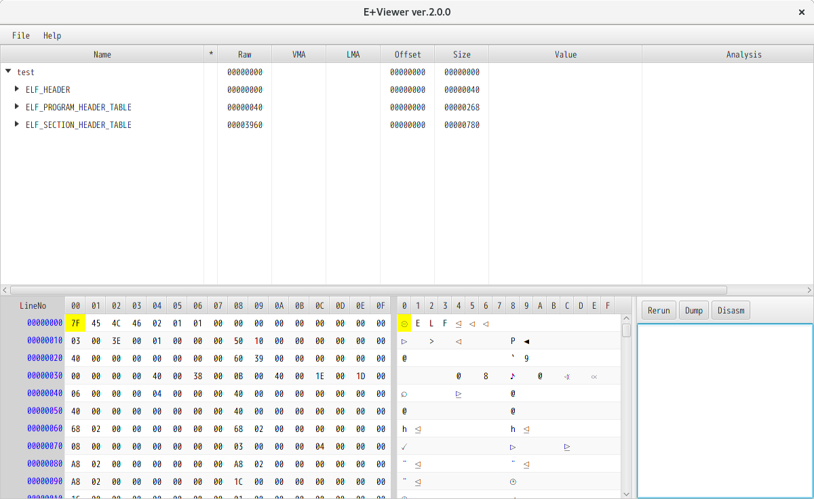
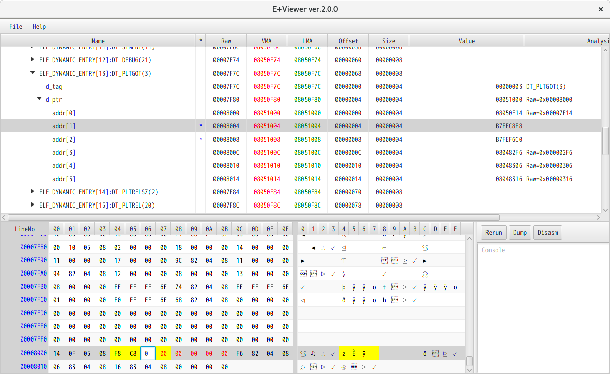
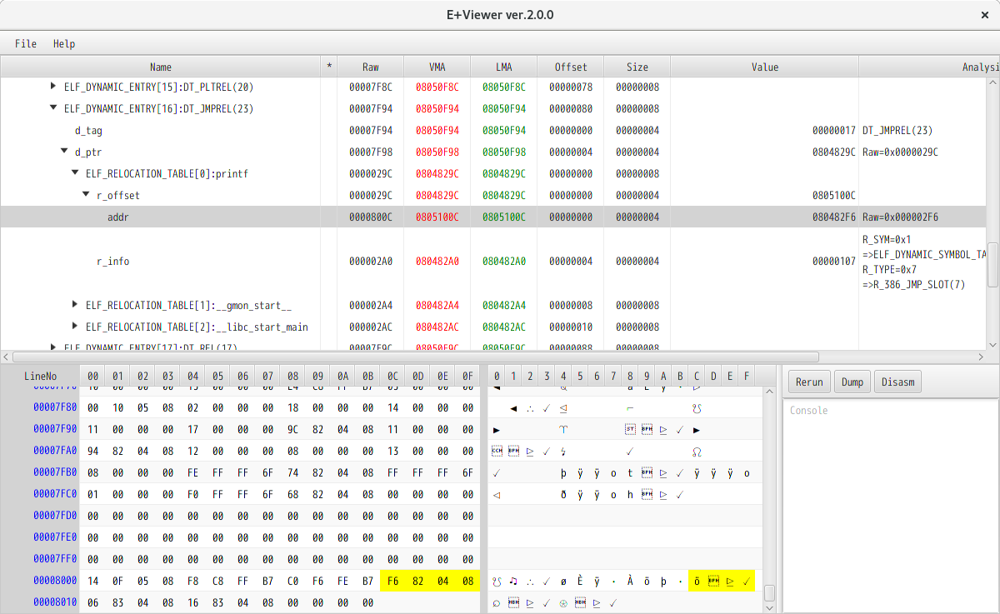
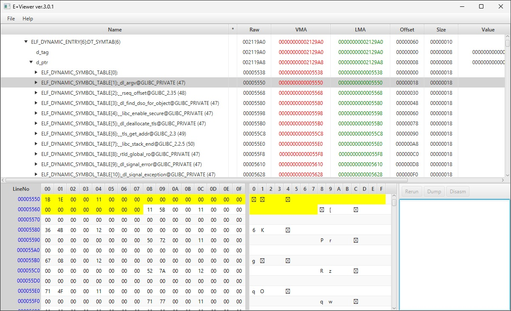
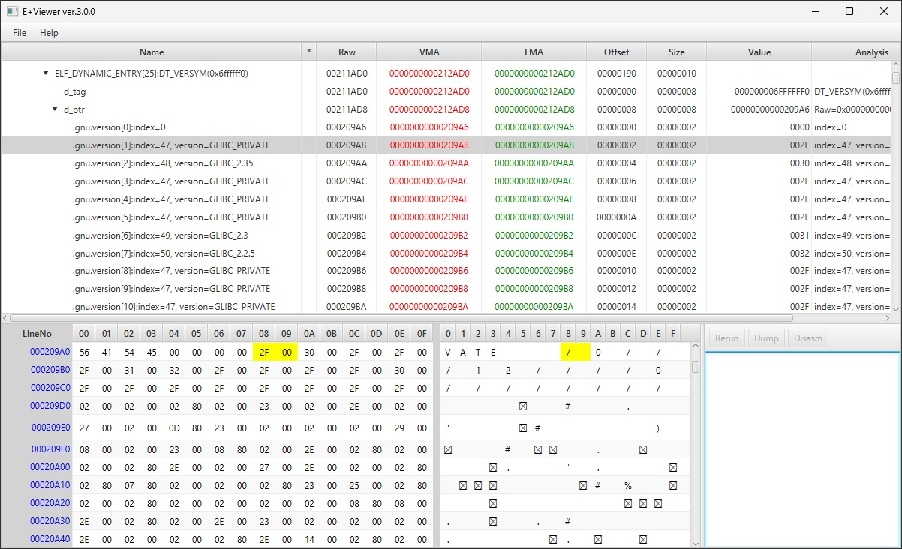
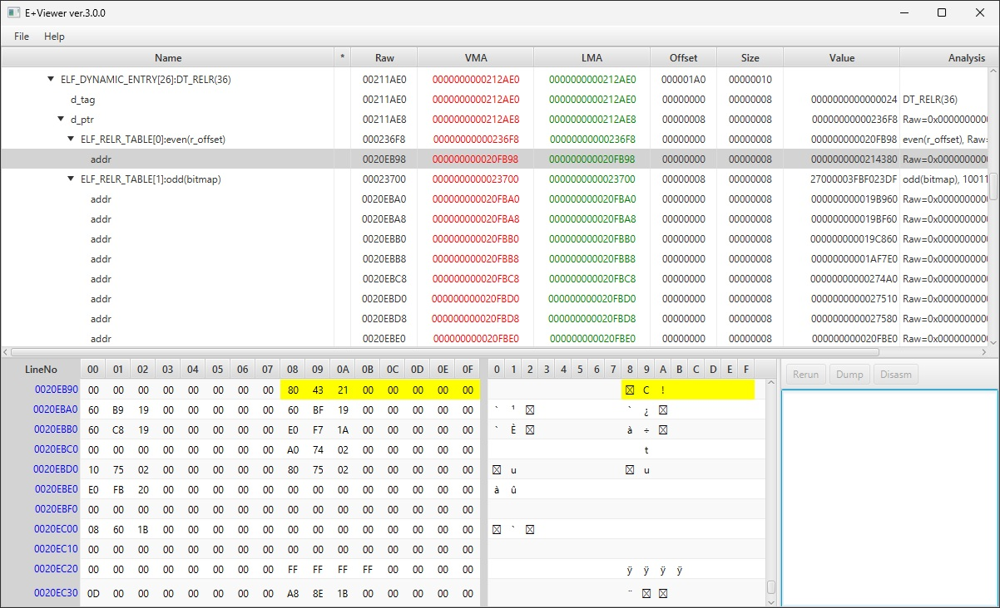
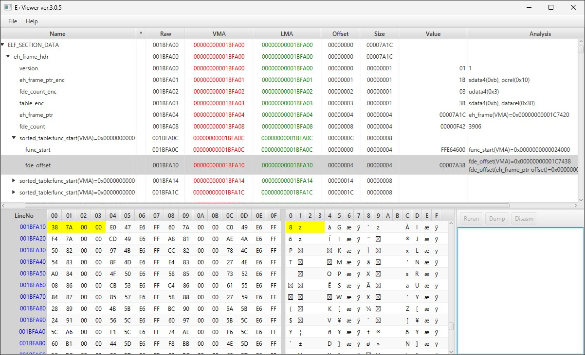
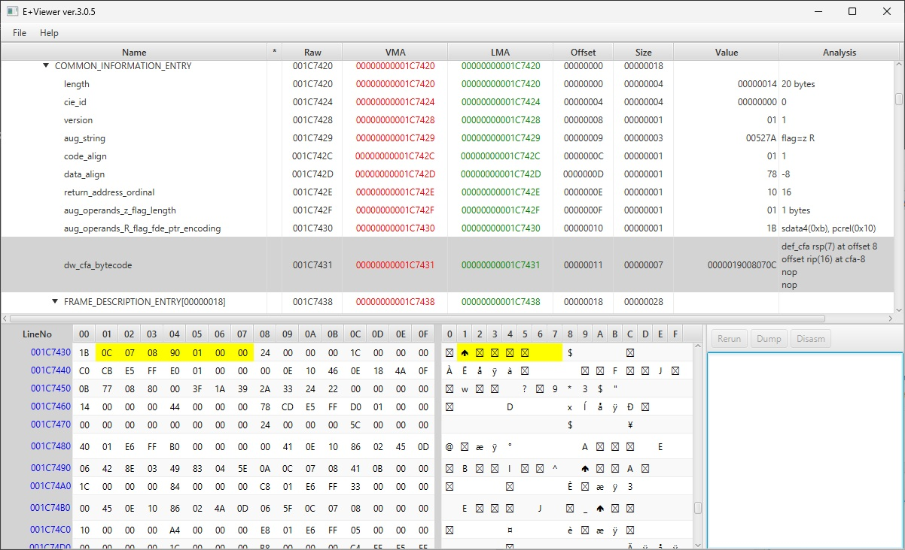
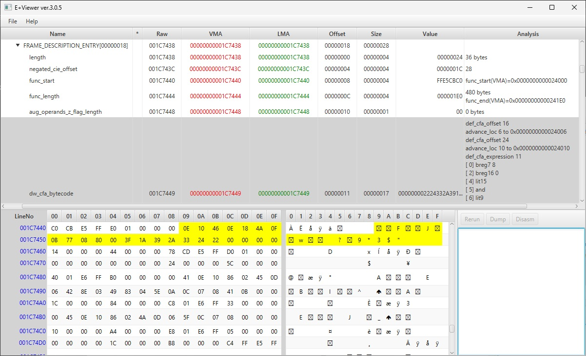

# E+Viewer

ELF(Executable and Linkable Format) File Viewer


## Summary

This tool is ELF File Viewer.

Few years ago(2015), I created this tool to learn ELF File.


## Cautions

<font style="color:red;font-size:150%">
This tool needs huge main memory(About 2GB main memory per 1MB file).<br>
Do not open a file over 1MB.<br>
</font>


## Installation

This tool (.jar file) can run in an environment where Java8 is installed.

- Java version 1.8.0_60(JRE)
    - <font style="color:blue">Note: This tool uses JavaFX 8.</font>

You can build this source code using OpenJDK 26 and OpenJFX 26.
```
cd src\UTF8_LF

javac -Xlint:deprecation --module-path "C:\Java\javafx-sdk-26.0.1\lib" --add-modules javafx.controls,javafx.fxml myproject\application\eplusviewer\Main.java myproject\application\eplusviewer\ApplicationController.java myproject\application\eplusviewer\BinTableRecord.java myproject\application\eplusviewer\DisasmController.java myproject\application\eplusviewer\DumpController.java myproject\application\eplusviewer\DumpTableRecord.java myproject\application\eplusviewer\EPlusViewerTreeTableRecord.java myproject\application\eplusviewer\ProgramHeader.java myproject\application\eplusviewer\SectionHeader.java myproject\application\eplusviewer\SLEB128Result.java myproject\application\eplusviewer\ULEB128Result.java

# run
java --module-path "C:\Java\javafx-sdk-26.0.1\lib" --add-modules javafx.controls,javafx.fxml myproject.application.eplusviewer.Main
```

## Example
1. Run
    ```
    java -Xmx4g -jar "E+Viewer3.0.7.jar"
    ```
1. Open ELF File([File]-[FileOpen])


## Screenshot



















## Additional Functions

You can use some functions if you input the following key in InputKey Dialog([Help]-[InputKey]).

- Key
    ```
    59bd99714b29f807723ad6aa3c6d9848d14a3074c253b94a1d2f7823ef5c9bf2
    ```
- Additional Functions
    - File Export
    - Binary Edit
    - ReRun
    - Dump
    - Disasm
        - <font style="color:blue">Note: You need to install objdump.</font>


## Develop

I develped this tool on the following environment.

- Windows 8.1 Pro(Japanese)
- Java version 1.8.0_60
- Eclipse IDE for Java Developers Mars.1 Release(4.5.1)
- e(fx)clipse
- JavaFX Scene Builder 2.0
